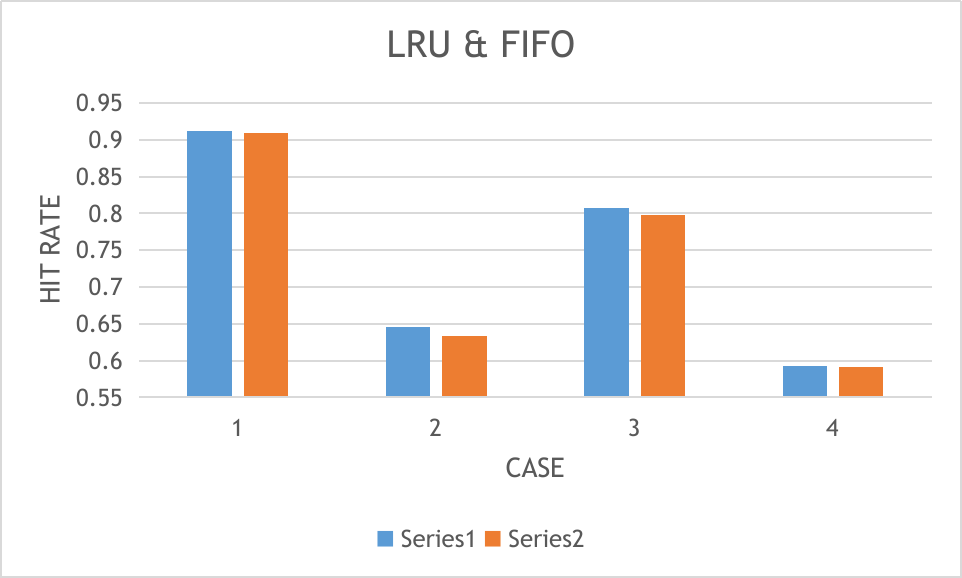
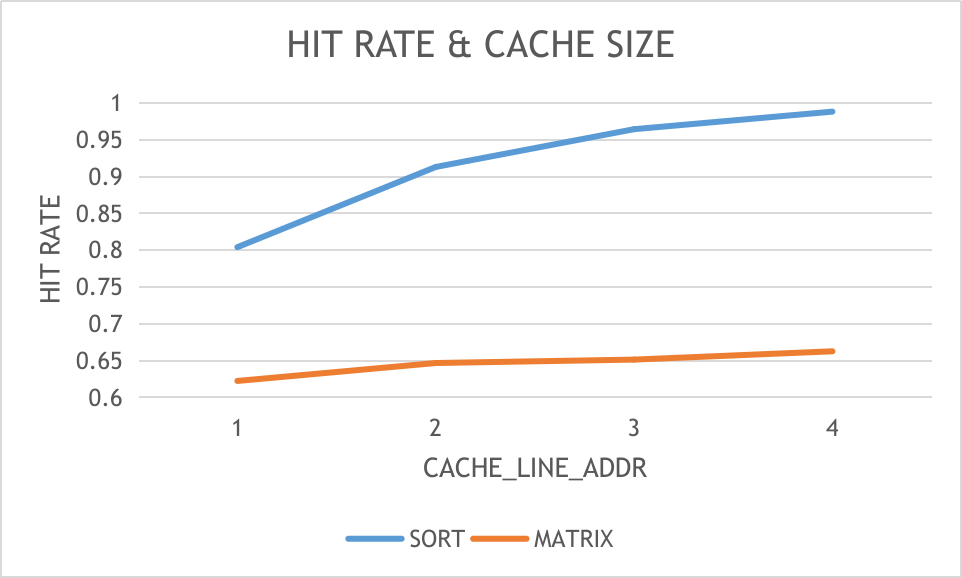
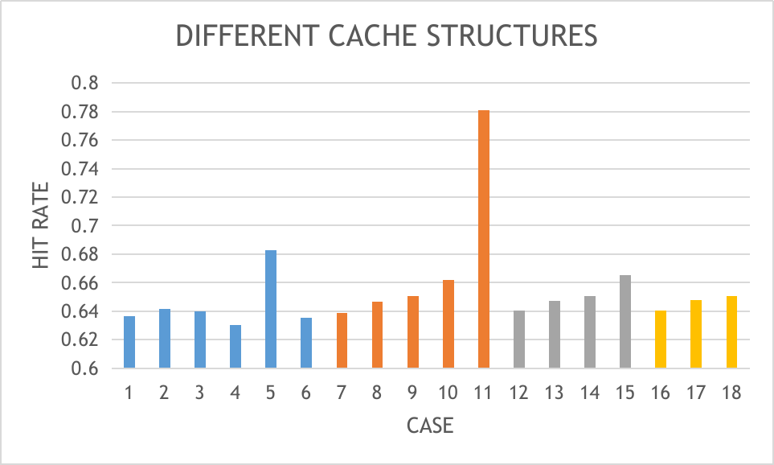

>Computer Architecture H Lab 3 Report
>
>郭耸霄 PB20111712

[TOC]

## 实验过程








xc7a100tcsg324-1


## 实验结论


## 仿真记录

| `STRA` | `PROG` | `WAY` | `LINE_ADDR` | `SET_ADDR` | `TAG_ADDR` | `HIT_COUNT` | `TOTAL_COUNT` | `HIT_RATE`  |
| :----: | :----: | :---: | :---------: | :--------: | :--------: | :---------: | :-----------: | :---------: |
|  LRU   |  SORT  |   2   |      2      |     2      |     8      |    6426     |     7042      | 0.912524851 |
|  LRU   | MATRIX |   2   |      2      |     2      |     8      |    8704     |     13472     | 0.64608076  |
|  FIFO  |  SORT  |   2   |      2      |     2      |     8      |    6426     |     7067      | 0.909296731 |
|  FIFO  | MATRIX |   2   |      2      |     2      |     8      |    8704     |     13728     | 0.634032634 |
|  LRU   |  SORT  |   4   |      1      |     1      |     8      |    6426     |     7964      | 0.806880964 |
|  LRU   | MATRIX |   4   |      1      |     1      |     8      |    8704     |     14672     | 0.593238822 |
|  FIFO  |  SORT  |   4   |      1      |     1      |     8      |    6426     |     8050      | 0.79826087  |
|  FIFO  | MATRIX |   4   |      1      |     1      |     8      |    8704     |     14720     | 0.591304348 |

采用LRU策略

| `PROG` | `WAY` | `LINE_ADDR` | `SET_ADDR` | `TAG_ADDR` | `HIT_COUNT` | `TOTAL_COUNT` | `HIT_RATE`  |
| :----: | :---: | :---------: | :--------: | :--------: | :---------: | :-----------: | :---------: |
|  SORT  |   2   |      1      |     2      |     11     |    6426     |     7997      | 0.803551332 |
| MATRIX |   2   |      1      |     2      |     11     |    8704     |     14000     | 0.621714286 |
|  SORT  |   2   |      2      |     2      |     10     |    6426     |     7042      | 0.912524851 |
| MATRIX |   2   |      2      |     2      |     10     |    8704     |     13472     | 0.64608076  |
|  SORT  |   2   |      3      |     2      |     9      |    6426     |     6667      | 0.963851807 |
| MATRIX |   2   |      3      |     2      |     9      |    8704     |     13376     | 0.650717703 |
|  SORT  |   2   |      4      |     2      |     8      |    6426     |     6506      | 0.987703658 |
| MATRIX |   2   |      4      |     2      |     8      |    8704     |     13148     | 0.662001825 |

采用LRU策略，测试使用矩阵乘法，保持主存及cache大小均不变

| `WAY` | `LINE_ADDR` | `SET_ADDR` | `TAG_ADDR` | `HIT_COUNT` | `TOTAL_COUNT` |   `HIT_RATE`    |
| :---: | :---------: | :--------: | :--------: | :---------: | :-----------: | :-------------: |
|   1   |      1      |     6      |     8      |    8704     |     13672     |   0.636629608   |
|   1   |      2      |     5      |     8      |    8704     |     13560     |   0.641887906   |
|   1   |      3      |     4      |     8      |    8704     |     13600     |      0.64       |
|   1   |      4      |     3      |     8      |    8704     |     13808     |   0.630359212   |
|   1   |      5      |     2      |     8      |    8704     |     12744     | ==0.682988073== |
|   1   |      6      |     1      |     8      |    8704     |     13700     |   0.635328467   |
|   2   |      1      |     5      |     9      |    8704     |     13620     |   0.639060206   |
|   2   |      2      |     4      |     9      |    8704     |     13456     |   0.646848989   |
|   2   |      3      |     3      |     9      |    8704     |     13376     |   0.650717703   |
|   2   |      4      |     2      |     9      |    8704     |     13148     |   0.662001825   |
|   2   |      5      |     1      |     9      |    8704     |     11148     | ==0.780767851== |
|   4   |      1      |     4      |     10     |    8704     |     13592     |   0.640376692   |
|   4   |      2      |     3      |     10     |    8704     |     13448     |   0.647233789   |
|   4   |      3      |     2      |     10     |    8704     |     13376     |   0.650717703   |
|   4   |      4      |     1      |     10     |    8704     |     13088     |   0.665036675   |
|   8   |      1      |     3      |     11     |    8704     |     13584     |   0.640753828   |
|   8   |      2      |     2      |     11     |    8704     |     13440     |   0.647619048   |
|   8   |      3      |     1      |     11     |    8704     |     13376     |   0.650717703   |

采用LRU策略，测试使用快速排序，保持主存及cache大小均不变

| `WAY` | `LINE_ADDR` | `SET_ADDR` | `TAG_ADDR` | `HIT_COUNT` | `TOTAL_COUNT` |   `HIT_RATE`    |
| :---: | :---------: | :--------: | :--------: | :---------: | :-----------: | :-------------: |
|   1   |      1      |     6      |     8      |    6426     |     7161      |   0.897360704   |
|   1   |      2      |     5      |     8      |    6426     |     6807      |   0.944028206   |
|   1   |      3      |     4      |     8      |    6426     |     6657      |   0.965299685   |
|   1   |      4      |     3      |     8      |    6426     |     6597      |   0.974079127   |
|   1   |      5      |     2      |     8      |    6426     |     6616      |   0.971281741   |
|   2   |      1      |     5      |     9      |    6426     |     6994      |   0.918787532   |
|   2   |      2      |     4      |     9      |    6426     |     6712      |   0.95738975    |
|   2   |      3      |     3      |     9      |    6426     |     6574      |   0.97748707    |
|   2   |      4      |     2      |     9      |    6426     |     6506      | ==0.987703658== |
|   2   |      5      |     1      |     9      |    6426     |     6478      | ==0.991972831== |
|   4   |      1      |     4      |     10     |    6426     |     7015      |   0.916037063   |
|   4   |      2      |     3      |     10     |    6426     |     6725      |   0.955539033   |
|   4   |      3      |     2      |     10     |    6426     |     6582      |   0.976298997   |
|   4   |      4      |     1      |     10     |    6426     |     6513      |    0.9866421    |
|   8   |      1      |     3      |     11     |    6426     |     7013      |   0.916298303   |
|   8   |      2      |     2      |     11     |    6426     |     6724      |   0.955681142   |
|   8   |      3      |     1      |     11     |    6426     |     6581      |   0.976447348   |

## 综合记录

2  5  1  9

```bash
Copyright 1986-2019 Xilinx, Inc. All Rights Reserved.
-----------------------------------------------------------------------------------------------------
| Tool Version : Vivado v.2019.2 (lin64) Build 2708876 Wed Nov  6 21:39:14 MST 2019
| Date         : Mon May  8 15:47:46 2023
| Host         : songxiao-HP-Pavilion-Aero-Laptop-13-be0152AU running 64-bit Ubuntu 20.04.6 LTS
| Command      : report_utilization -file cache_utilization_synth.rpt -pb cache_utilization_synth.pb
| Design       : cache
| Device       : 7a100tcsg324-1
| Design State : Synthesized
-----------------------------------------------------------------------------------------------------

1. Slice Logic
--------------

+-------------------------+------+-------+-----------+-------+
|        Site Type        | Used | Fixed | Available | Util% |
+-------------------------+------+-------+-----------+-------+
| Slice LUTs*             | 4272 |     0 |     63400 |  6.74 |
|   LUT as Logic          | 4272 |     0 |     63400 |  6.74 |
|   LUT as Memory         |    0 |     0 |     19000 |  0.00 |
| Slice Registers         | 7430 |     0 |    126800 |  5.86 |
|   Register as Flip Flop | 7430 |     0 |    126800 |  5.86 |
|   Register as Latch     |    0 |     0 |    126800 |  0.00 |
| F7 Muxes                |  398 |     0 |     31700 |  1.26 |
| F8 Muxes                |   61 |     0 |     15850 |  0.38 |
+-------------------------+------+-------+-----------+-------+
```

2  4  2  9

```bash
Copyright 1986-2019 Xilinx, Inc. All Rights Reserved.
-----------------------------------------------------------------------------------------------------
| Tool Version : Vivado v.2019.2 (lin64) Build 2708876 Wed Nov  6 21:39:14 MST 2019
| Date         : Mon May  8 15:49:35 2023
| Host         : songxiao-HP-Pavilion-Aero-Laptop-13-be0152AU running 64-bit Ubuntu 20.04.6 LTS
| Command      : report_utilization -file cache_utilization_synth.rpt -pb cache_utilization_synth.pb
| Design       : cache
| Device       : 7a100tcsg324-1
| Design State : Synthesized
-----------------------------------------------------------------------------------------------------

1. Slice Logic
--------------

+-------------------------+------+-------+-----------+-------+
|        Site Type        | Used | Fixed | Available | Util% |
+-------------------------+------+-------+-----------+-------+
| Slice LUTs*             | 3657 |     0 |     63400 |  5.77 |
|   LUT as Logic          | 3657 |     0 |     63400 |  5.77 |
|   LUT as Memory         |    0 |     0 |     19000 |  0.00 |
| Slice Registers         | 5940 |     0 |    126800 |  4.68 |
|   Register as Flip Flop | 5940 |     0 |    126800 |  4.68 |
|   Register as Latch     |    0 |     0 |    126800 |  0.00 |
| F7 Muxes                |  151 |     0 |     31700 |  0.48 |
| F8 Muxes                |    0 |     0 |     15850 |  0.00 |
+-------------------------+------+-------+-----------+-------+
```

1  5  2  8

```bash
Copyright 1986-2019 Xilinx, Inc. All Rights Reserved.
-----------------------------------------------------------------------------------------------------
| Tool Version : Vivado v.2019.2 (lin64) Build 2708876 Wed Nov  6 21:39:14 MST 2019
| Date         : Mon May  8 15:51:22 2023
| Host         : songxiao-HP-Pavilion-Aero-Laptop-13-be0152AU running 64-bit Ubuntu 20.04.6 LTS
| Command      : report_utilization -file cache_utilization_synth.rpt -pb cache_utilization_synth.pb
| Design       : cache
| Device       : 7a100tcsg324-1
| Design State : Synthesized
-----------------------------------------------------------------------------------------------------

1. Slice Logic
--------------

+-------------------------+------+-------+-----------+-------+
|        Site Type        | Used | Fixed | Available | Util% |
+-------------------------+------+-------+-----------+-------+
| Slice LUTs*             | 4524 |     0 |     63400 |  7.14 |
|   LUT as Logic          | 4524 |     0 |     63400 |  7.14 |
|   LUT as Memory         |    0 |     0 |     19000 |  0.00 |
| Slice Registers         | 7420 |     0 |    126800 |  5.85 |
|   Register as Flip Flop | 7420 |     0 |    126800 |  5.85 |
|   Register as Latch     |    0 |     0 |    126800 |  0.00 |
| F7 Muxes                |  403 |     0 |     31700 |  1.27 |
| F8 Muxes                |   84 |     0 |     15850 |  0.53 |
+-------------------------+------+-------+-----------+-------+
```

## 问题记录

### May 6 

13:53 

FIFO_swap_way = X

13:56 

cache_miss 反了

14:31 

tag 不足

14:37 

缺失读回写错

14:50 

LRU 命中时队列错误

15:45 

没有FULL_code

19:28 

riscv32工具链只有windows版本 

### May 7

10:26 

bubbleM

11:43 

FIFO/LRU queue 未分组

14:30 

cache miss 时WB段应该bubble 

16:34 

IR模块不适应存在cache miss的情况

### May 8

14:41 

综合失败

15:45 

更改WB_Data文件中的cache，没有影响到综合

17:57 

图表无坐标轴
