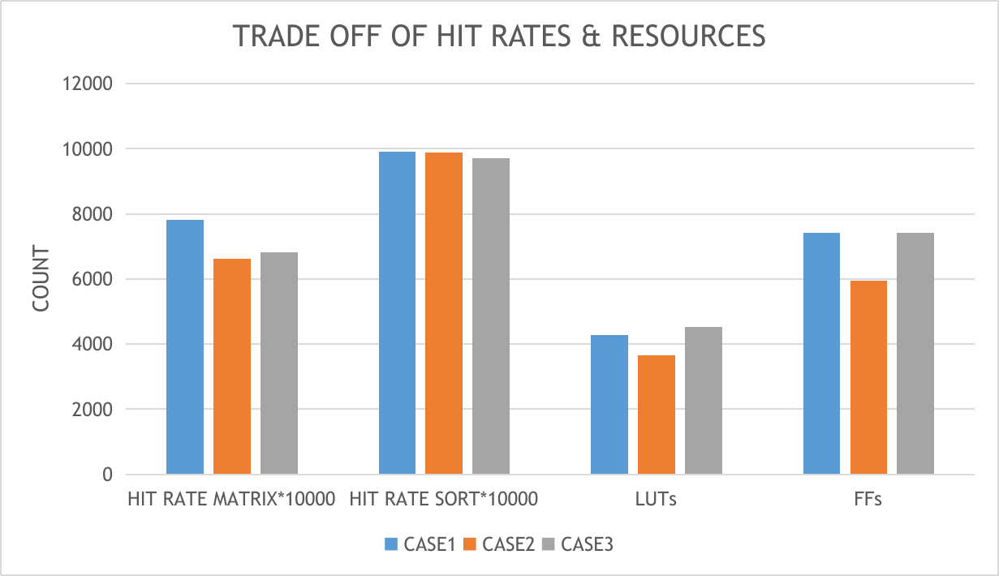

>Computer Architecture H Lab 3 Report
>
>郭耸霄 PB20111712

[TOC]

## 实验过程

### 替换策略

在完成本次实验的第 1、2 阶段后，我设计以下实验来探究对于给定的测试样例，Cache 采用何种布局最优。首先探究替换策略。首先选取 2 种规模的 Cache，分别以快速排序和矩阵乘法作为 Benchmark。得到以下结果（数据见[仿真记录 Phase 1](#Phase 1)）。图表中<font color=#08f>蓝色</font>为 LRU 的结果，<font color=#f60>橙色</font>为 FIFO 的结果。


由上表可知，LRU 替换策略在这些情况下都优于 FIFO 策略。这样我们以下均选用 LRU 策略。

### Cache 大小

选取 LRU 策略后，我们来考虑 Cache 的总大小。在保持主存大小不变的情况下，通过仅改变 Cache 行的大小，来记录命中率的变化。（数据见[仿真记录 Phase 2](#Phase 2)）可以看到，当 Cache 大小增加到 128 B 时，命中率增长已经很缓慢。一个很明显的事实是 Cache 越大，命中率越高（如果像主存一样大可以达到 100% 的命中率），但我们只需要选择一个使得命中率已经相对较高，并且再增大 Cache 的大小，命中率增长缓慢的点即可。所以下面的实验我们都选用 128B 的 Cache。


### Cache 结构

在确定了 Cache 大小后，我们通过改变 Cache 行大小、组数以及路数来观察命中率的改变情况。其中<font color=#08f>蓝色</font>为 1 路的情况，<font color=#f80>橙色</font>为 2 路的情况，<font color=#888>灰色</font>为 4 路的情况，<font color=#fc0>黄色</font>为 8 路的情况。

对于矩阵乘法的测试结果如下（数据见[仿真记录 Phase 3](#Phase 3-1)）：


其中命中率最为显著的两个 Cache 结构是：

- Case 11：2 路，1 组，每行 32 个字，命中率 78.08%；
- Case 5：1 路，2 组，每行 32 个字，命中率 68.30%。

对于快速排序的测试结果如下（数据见[仿真记录 Phase 3](#Phase 3-2)）：


其中命中率最为显著的两个 Cache 结构是：

- Case 10：2 路，1 组，每行 32 个字，命中率 99.20%；
- Case 9：2 路，2 组，每行 16 个字，命中率 98.77%。

对于以上选出显著的结构，我们将进一步根据资源使用情况进行权衡。对于其他结构，虽然可能具有更优的资源使用情况，但是我们更希望选出命中率尽可能高的结构，故暂且不考虑它们。

### 资源使用

使用 Xilinx Vivado 2019.2 进行综合，选择开发板型号 xc7a100tcsg324-1，得到以下结果（综合报告（部分）见[综合记录](#综合记录)），其中：

- <font color=#08f>Case 1</font>：2 路，1 组，每行 32 个字；
- <font color=#f80>Case 2</font>：2 路，2 组，每行 16 个字；
- <font color=#888>Case 3</font>：1 路，2 组，每行 32 个字。



可以发现，虽然 Case 1 的命中率在两个测试程序下都最高，但其资源消耗也最多。当运行矩阵乘法时，Case 1 的命中率明显高于其他两组，这个领先优势足以弥补其在资源消耗的劣势；当运行快速排序时，Case 2 的命中率与 Case 1基本上持平，并且它的资源利用率比 Case 1 有明显的减少，值得使用 Case 2。

## 实验总结

在本次实验中，我们研究了对于 256 个数的快速排序程序以及 16x16 规模的矩阵乘法来综合选用 Cache 替换策略、大小及结构。由于数据量较小，选择的 Cache 大小都在相应较小的情况下进行。最终的结论是：

- **快速排序：使用 LRU 策略，2 路，1 组，每行 32 个字；**
- **矩阵乘法：使用 LRU 策略，2 路，2 组，每行 16 个字。**

下面是本次实验中的数据及问题记录。

## 仿真记录

### Phase 1

| `STRA` | `PROG` | `WAY` | `LINE_ADDR` | `SET_ADDR` | `TAG_ADDR` | `HIT_COUNT` | `TOTAL_COUNT` | `HIT_RATE`  |
| :----: | :----: | :---: | :---------: | :--------: | :--------: | :---------: | :-----------: | :---------: |
|  LRU   |  SORT  |   2   |      2      |     2      |     8      |    6426     |     7042      | 0.912524851 |
|  LRU   | MATRIX |   2   |      2      |     2      |     8      |    8704     |     13472     | 0.64608076  |
|  FIFO  |  SORT  |   2   |      2      |     2      |     8      |    6426     |     7067      | 0.909296731 |
|  FIFO  | MATRIX |   2   |      2      |     2      |     8      |    8704     |     13728     | 0.634032634 |
|  LRU   |  SORT  |   4   |      1      |     1      |     8      |    6426     |     7964      | 0.806880964 |
|  LRU   | MATRIX |   4   |      1      |     1      |     8      |    8704     |     14672     | 0.593238822 |
|  FIFO  |  SORT  |   4   |      1      |     1      |     8      |    6426     |     8050      | 0.79826087  |
|  FIFO  | MATRIX |   4   |      1      |     1      |     8      |    8704     |     14720     | 0.591304348 |

### Phase 2

采用 LRU 策略。

| `PROG` | `WAY` | `LINE_ADDR` | `SET_ADDR` | `TAG_ADDR` | `HIT_COUNT` | `TOTAL_COUNT` | `HIT_RATE`  |
| :----: | :---: | :---------: | :--------: | :--------: | :---------: | :-----------: | :---------: |
|  SORT  |   2   |      1      |     2      |     11     |    6426     |     7997      | 0.803551332 |
| MATRIX |   2   |      1      |     2      |     11     |    8704     |     14000     | 0.621714286 |
|  SORT  |   2   |      2      |     2      |     10     |    6426     |     7042      | 0.912524851 |
| MATRIX |   2   |      2      |     2      |     10     |    8704     |     13472     | 0.64608076  |
|  SORT  |   2   |      3      |     2      |     9      |    6426     |     6667      | 0.963851807 |
| MATRIX |   2   |      3      |     2      |     9      |    8704     |     13376     | 0.650717703 |
|  SORT  |   2   |      4      |     2      |     8      |    6426     |     6506      | 0.987703658 |
| MATRIX |   2   |      4      |     2      |     8      |    8704     |     13148     | 0.662001825 |

### Phase 3

#### Phase 3-1

采用 LRU 策略，测试使用矩阵乘法，保持主存及 Cache 大小均不变。

| `CASE` | `WAY` | `LINE_ADDR` | `SET_ADDR` | `TAG_ADDR` | `HIT_COUNT` | `TOTAL_COUNT` |   `HIT_RATE`    |
| :----: | :---: | :---------: | :--------: | :--------: | :---------: | :-----------: | :-------------: |
|   1    |   1   |      1      |     6      |     8      |    8704     |     13672     |   0.636629608   |
|   2    |   1   |      2      |     5      |     8      |    8704     |     13560     |   0.641887906   |
|   3    |   1   |      3      |     4      |     8      |    8704     |     13600     |      0.64       |
|   4    |   1   |      4      |     3      |     8      |    8704     |     13808     |   0.630359212   |
|   5    |   1   |      5      |     2      |     8      |    8704     |     12744     | ==0.682988073== |
|   6    |   1   |      6      |     1      |     8      |    8704     |     13700     |   0.635328467   |
|   7    |   2   |      1      |     5      |     9      |    8704     |     13620     |   0.639060206   |
|   8    |   2   |      2      |     4      |     9      |    8704     |     13456     |   0.646848989   |
|   9    |   2   |      3      |     3      |     9      |    8704     |     13376     |   0.650717703   |
|   10   |   2   |      4      |     2      |     9      |    8704     |     13148     |   0.662001825   |
|   11   |   2   |      5      |     1      |     9      |    8704     |     11148     | ==0.780767851== |
|   12   |   4   |      1      |     4      |     10     |    8704     |     13592     |   0.640376692   |
|   13   |   4   |      2      |     3      |     10     |    8704     |     13448     |   0.647233789   |
|   14   |   4   |      3      |     2      |     10     |    8704     |     13376     |   0.650717703   |
|   15   |   4   |      4      |     1      |     10     |    8704     |     13088     |   0.665036675   |
|   16   |   8   |      1      |     3      |     11     |    8704     |     13584     |   0.640753828   |
|   17   |   8   |      2      |     2      |     11     |    8704     |     13440     |   0.647619048   |
|   18   |   8   |      3      |     1      |     11     |    8704     |     13376     |   0.650717703   |

#### Phase 3-2

采用 LRU 策略，测试使用快速排序，保持主存及 Cache 大小均不变。

| `CASE` | `WAY` | `LINE_ADDR` | `SET_ADDR` | `TAG_ADDR` | `HIT_COUNT` | `TOTAL_COUNT` |   `HIT_RATE`    |
| :----: | :---: | :---------: | :--------: | :--------: | :---------: | :-----------: | :-------------: |
|   1    |   1   |      1      |     6      |     8      |    6426     |     7161      |   0.897360704   |
|   2    |   1   |      2      |     5      |     8      |    6426     |     6807      |   0.944028206   |
|   3    |   1   |      3      |     4      |     8      |    6426     |     6657      |   0.965299685   |
|   4    |   1   |      4      |     3      |     8      |    6426     |     6597      |   0.974079127   |
|   5    |   1   |      5      |     2      |     8      |    6426     |     6616      |   0.971281741   |
|   6    |   2   |      1      |     5      |     9      |    6426     |     6994      |   0.918787532   |
|   7    |   2   |      2      |     4      |     9      |    6426     |     6712      |   0.95738975    |
|   8    |   2   |      3      |     3      |     9      |    6426     |     6574      |   0.97748707    |
|   9    |   2   |      4      |     2      |     9      |    6426     |     6506      | ==0.987703658== |
|   10   |   2   |      5      |     1      |     9      |    6426     |     6478      | ==0.991972831== |
|   11   |   4   |      1      |     4      |     10     |    6426     |     7015      |   0.916037063   |
|   12   |   4   |      2      |     3      |     10     |    6426     |     6725      |   0.955539033   |
|   13   |   4   |      3      |     2      |     10     |    6426     |     6582      |   0.976298997   |
|   14   |   4   |      4      |     1      |     10     |    6426     |     6513      |    0.9866421    |
|   15   |   8   |      1      |     3      |     11     |    6426     |     7013      |   0.916298303   |
|   16   |   8   |      2      |     2      |     11     |    6426     |     6724      |   0.955681142   |
|   17   |   8   |      3      |     1      |     11     |    6426     |     6581      |   0.976447348   |

## 综合记录

2 路，2 组，每行 32 个字。

```bash
Copyright 1986-2019 Xilinx, Inc. All Rights Reserved.
-----------------------------------------------------------------------------------------------------
| Tool Version : Vivado v.2019.2 (lin64) Build 2708876 Wed Nov  6 21:39:14 MST 2019
| Date         : Mon May  8 15:47:46 2023
| Host         : songxiao-HP-Pavilion-Aero-Laptop-13-be0152AU running 64-bit Ubuntu 20.04.6 LTS
| Command      : report_utilization -file cache_utilization_synth.rpt -pb cache_utilization_synth.pb
| Design       : cache
| Device       : 7a100tcsg324-1
| Design State : Synthesized
-----------------------------------------------------------------------------------------------------

1. Slice Logic
--------------

+-------------------------+------+-------+-----------+-------+
|        Site Type        | Used | Fixed | Available | Util% |
+-------------------------+------+-------+-----------+-------+
| Slice LUTs*             | 4272 |     0 |     63400 |  6.74 |
|   LUT as Logic          | 4272 |     0 |     63400 |  6.74 |
|   LUT as Memory         |    0 |     0 |     19000 |  0.00 |
| Slice Registers         | 7430 |     0 |    126800 |  5.86 |
|   Register as Flip Flop | 7430 |     0 |    126800 |  5.86 |
|   Register as Latch     |    0 |     0 |    126800 |  0.00 |
| F7 Muxes                |  398 |     0 |     31700 |  1.26 |
| F8 Muxes                |   61 |     0 |     15850 |  0.38 |
+-------------------------+------+-------+-----------+-------+
```

2 路，1 组，每行 16 个字。

```bash
Copyright 1986-2019 Xilinx, Inc. All Rights Reserved.
-----------------------------------------------------------------------------------------------------
| Tool Version : Vivado v.2019.2 (lin64) Build 2708876 Wed Nov  6 21:39:14 MST 2019
| Date         : Mon May  8 15:49:35 2023
| Host         : songxiao-HP-Pavilion-Aero-Laptop-13-be0152AU running 64-bit Ubuntu 20.04.6 LTS
| Command      : report_utilization -file cache_utilization_synth.rpt -pb cache_utilization_synth.pb
| Design       : cache
| Device       : 7a100tcsg324-1
| Design State : Synthesized
-----------------------------------------------------------------------------------------------------

1. Slice Logic
--------------

+-------------------------+------+-------+-----------+-------+
|        Site Type        | Used | Fixed | Available | Util% |
+-------------------------+------+-------+-----------+-------+
| Slice LUTs*             | 3657 |     0 |     63400 |  5.77 |
|   LUT as Logic          | 3657 |     0 |     63400 |  5.77 |
|   LUT as Memory         |    0 |     0 |     19000 |  0.00 |
| Slice Registers         | 5940 |     0 |    126800 |  4.68 |
|   Register as Flip Flop | 5940 |     0 |    126800 |  4.68 |
|   Register as Latch     |    0 |     0 |    126800 |  0.00 |
| F7 Muxes                |  151 |     0 |     31700 |  0.48 |
| F8 Muxes                |    0 |     0 |     15850 |  0.00 |
+-------------------------+------+-------+-----------+-------+
```

1 路，2 组，每行 32 个字

```bash
Copyright 1986-2019 Xilinx, Inc. All Rights Reserved.
-----------------------------------------------------------------------------------------------------
| Tool Version : Vivado v.2019.2 (lin64) Build 2708876 Wed Nov  6 21:39:14 MST 2019
| Date         : Mon May  8 15:51:22 2023
| Host         : songxiao-HP-Pavilion-Aero-Laptop-13-be0152AU running 64-bit Ubuntu 20.04.6 LTS
| Command      : report_utilization -file cache_utilization_synth.rpt -pb cache_utilization_synth.pb
| Design       : cache
| Device       : 7a100tcsg324-1
| Design State : Synthesized
-----------------------------------------------------------------------------------------------------

1. Slice Logic
--------------

+-------------------------+------+-------+-----------+-------+
|        Site Type        | Used | Fixed | Available | Util% |
+-------------------------+------+-------+-----------+-------+
| Slice LUTs*             | 4524 |     0 |     63400 |  7.14 |
|   LUT as Logic          | 4524 |     0 |     63400 |  7.14 |
|   LUT as Memory         |    0 |     0 |     19000 |  0.00 |
| Slice Registers         | 7420 |     0 |    126800 |  5.85 |
|   Register as Flip Flop | 7420 |     0 |    126800 |  5.85 |
|   Register as Latch     |    0 |     0 |    126800 |  0.00 |
| F7 Muxes                |  403 |     0 |     31700 |  1.27 |
| F8 Muxes                |   84 |     0 |     15850 |  0.53 |
+-------------------------+------+-------+-----------+-------+
```

## 问题记录

### May 6 

13:53 ：采用`FIFO` 策略时，未将队列初始化，导致`FIFO_swap_way`信号为 `X`，无法选择该替换的路。

13:56 ：`cache_miss`信号处理逻辑错误，导致缺失时将无效数据取出。

14:31 ：Cache 中同一个 set 的不同 lines 应该有相应的 tags ，但是不小心将他们设成相同。

14:37：Cache 缺失后，从主存读回数据，写入错误的 Cache 位置。

14:50：采用`LRU`策略时，当命中时，队列更新方式错误。

15:45：根据实验文档，没有发布`FULL_code`，导致实验暂停。

19:28：实验仓库中提供的 RISC-V32 工具链只有 Windows 版本， 生成指令以及数据的脚本也仅适配于 Windows 操作系统。

### May 7

10:26：在 Cache 缺失时，应该`bubbleM`。

11:43：FIFO/LRU queues 未分组，导致一个 Cache 组的替换会影响其他组的替换。

14:30：cache miss 时 WB 段应该`bubbleW` 。

16:34：IR 模块不适应存在 cache miss 的情况。==此处为代码框架错误。==

### May 8

14:41：综合失败。原因为选择了无 license 的开发板型号。

15:45：在调参数时，更改 `WB_Data.sv` 文件中例化的 cache 参数，导致综合结果未变。
