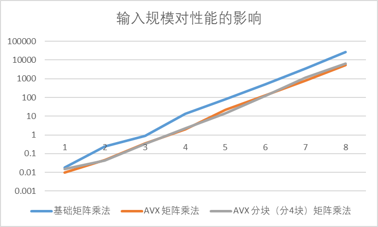
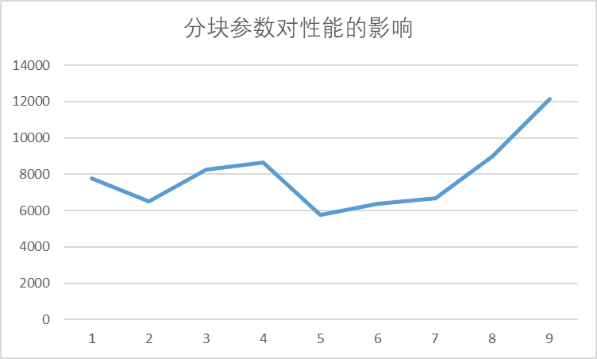
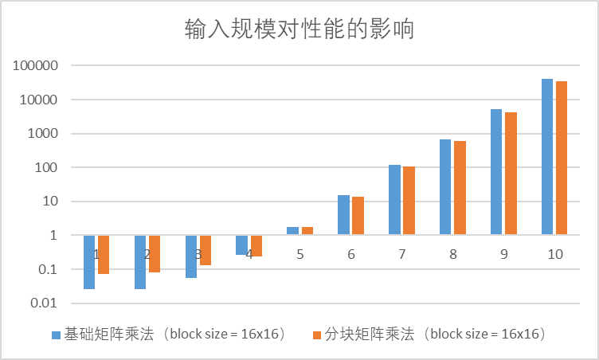
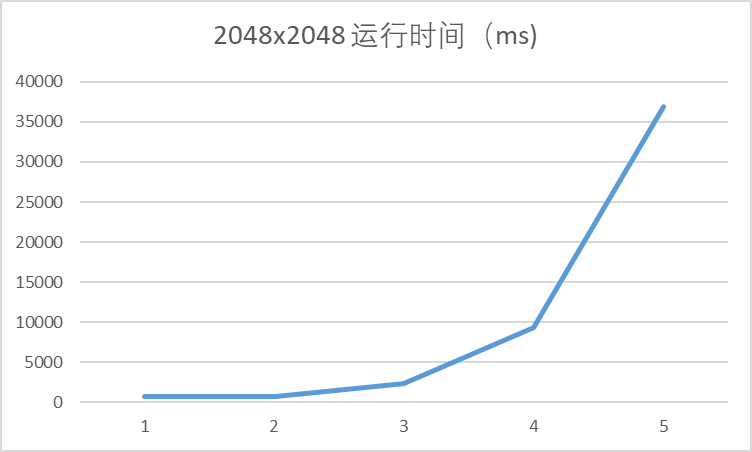
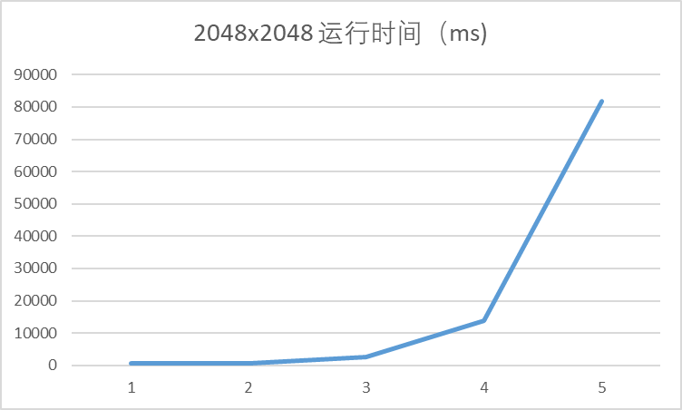

> Computer Architecture Honor Class Lab 5 Report
>
> 郭耸霄 PB20111712

[TOC]

# 数据级并行实验

## CPU

### 环境信息

```
Device name	THINKPAD-T14
Processor	12th Gen Intel(R) Core(TM) i7-1260P   2.10 GHz
Installed RAM	16.0 GB (15.7 GB usable)
Device ID	CA4A3DA5-AF88-4F61-BFB3-CB6F73AECD3F
Product ID	00326-10000-00000-AA871
System type	64-bit operating system, x64-based processor
Pen and touch	No pen or touch input is available for this display
Edition	Windows 11 Home
Version	22H2
Installed on	‎5/‎15/‎2023
OS build	22621.1702
Serial number	PF46FFXL
Experience	Windows Feature Experience Pack 1000.22641.1000.0
```

### 输入规模对性能的影响

以下为实验数据：

| 实验组别 | 矩阵规模\运行时间（ms）\实现方式 | 基础矩阵乘法 | AVX 矩阵乘法 | AVX 分块（分4块）矩阵乘法 |
| :------: | :------------------------------: | :----------: | :----------: | :-----------------------: |
|    1     |              16x16               |    0.0182    |    0.0099    |           0.015           |
|    2     |              32x32               |    0.2478    |    0.047     |          0.0443           |
|    3     |              64x64               |    0.9154    |    0.3606    |          0.3271           |
|    4     |             128x128              |   13.3552    |    2.0105    |          2.1816           |
|    5     |             256x256              |   79.0386    |   21.4222    |          14.1532          |
|    6     |             512x512              |   530.615    |   131.292    |          121.066          |
|    7     |            1024x1024             |   3488.06    |   804.659    |          1123.11          |
|    8     |            2048x2048             |   26709.7    |   5266.31    |          6609.57          |

将纵轴取对数，得到下面的折线统计图：



基础矩阵乘法是最简单的矩阵乘法实现方法，它直接按照矩阵乘法的定义进行计算。对于较小的矩阵，基础矩阵乘法可以表现出较好的性能，因为它没有额外的计算负担和数据传输开销。但是，对于大规模的矩阵乘法计算，基础矩阵乘法的性能会受到 CPU 缓存大小和数据传输带宽的限制，因此会表现出较差的性能。

AVX 矩阵乘法是基于向量寄存器的矩阵乘法实现方法，它可以利用 CPU 的 SIMD 指令集加速计算。AVX 矩阵乘法将多个元素打包成向量进行计算，可以提高计算效率。对于中等规模的矩阵乘法计算，AVX 矩阵乘法通常比基础矩阵乘法更快，因为它可以利用 CPU 的向量寄存器进行并行计算。但是，对于非常大的矩阵乘法计算，AVX 矩阵乘法的性能也会受到 CPU 缓存大小和数据传输带宽的限制。

AVX 分块矩阵乘法是一种基于 AVX 矩阵乘法的改进方法，它可以通过将大矩阵分解成多个小矩阵，利用 CPU 缓存的局部性和向量寄存器的并行计算来加速矩阵乘法计算。AVX 分块矩阵乘法的性能通常比 AVX 矩阵乘法更好，特别是对于非常大的矩阵乘法计算，因为它可以充分利用 CPU 缓存和向量寄存器的优势。**但在本次实验中，由于矩阵规模并不够大，分块运算的额外开销比起分块带来的访存优势更大，所以在大部分测试点上，AVX 分块矩阵乘法没有 AVX 矩阵乘法性能更好。**

总的来说，基础矩阵乘法适用于小规模的矩阵乘法计算；AVX 矩阵乘法适用于中等规模的矩阵乘法计算；AVX 分块矩阵乘法适用于非常大的矩阵乘法计算。但是，这些方法的性能也会受到具体的 CPU 架构、缓存大小和数据传输带宽等因素的影响，因此在实际应用中需要根据具体情况进行选择。

### 分块参数对性能的影响

以下为实验数据：

| 实验组别 | 分块数 | 2048x2048 运行时间（ms) |
| :------: | :----: | :---------------------: |
|    1     |   1    |         7785.8          |
|    2     |   4    |         6501.18         |
|    3     |   16   |         8253.93         |
|    4     |   64   |         8630.83         |
|    5     |  256   |         5775.16         |
|    6     |  1024  |         6362.19         |
|    7     |  4096  |         6688.74         |
|    8     | 16384  |         9002.06         |
|    9     | 65536  |         12124.3         |

根据实验数据画出的折线图：



AVX 分块矩阵乘法是一种基于 AVX 矩阵乘法的改进方法，可以通过将大矩阵分解成多个小矩阵，利用 CPU 缓存的局部性和向量寄存器的并行计算来加速矩阵乘法计算。分块参数是指将大矩阵分解成多个小矩阵时，每个小矩阵的行数和列数。不同的分块参数会对性能产生不同的影响。

当分块参数较小的时候，每个小矩阵的规模较小，可以利用 CPU 缓存的局部性，减少数据传输的开销，从而提高计算效率。但是，当分块参数过小的时候，会使得小矩阵的规模太小，难以利用向量寄存器的并行计算能力，从而降低计算效率。

当分块参数较大的时候，每个小矩阵的规模较大，可以充分利用向量寄存器的并行计算能力，从而提高计算效率。但是，当分块参数过大的时候，会使得小矩阵的规模过大，超出了 CPU 缓存的容量，导致缓存失效，从而降低计算效率。

因此，在实现 AVX 分块矩阵乘法时，需要根据具体的 CPU 架构、缓存大小和数据传输带宽等因素来选择合适的分块参数。一般来说，分块参数应该根据 CPU 缓存的大小和矩阵的规模来确定，以充分利用 CPU 缓存的局部性和向量寄存器的并行计算能力。**在本次实验中，较为适中的分块参数得到了最好的性能，即第 5 组（16x16）分块的运行时间最小。**

### CPU 平台上矩阵乘法的其他优化手段

1. Cache 优化：通过利用 CPU 缓存来减少内存访问次数，从而提高矩阵乘法的性能。具体方法包括利用局部性原则调整矩阵的存储顺序，使得矩阵元素能够更好地利用 CPU 缓存，以及使用 Tiling 的方法将矩阵分成小块，使得每个小块能够完全存储在 CPU 缓存中，从而减少内存访问次数。

2. 多线程并行化：利用多线程并行化来加速矩阵乘法。具体方法包括使用 OpenMP、Pthreads 等线程库来实现多线程并行，以及使用 SIMD 指令对每个线程的运算进行加速。

3. 原地计算：在原地计算矩阵乘法时，可以减少内存访问和数据移动的次数，从而提高性能。具体方法包括使用 in-place 算法对矩阵的乘积进行计算。

4. 基于 BLAS 库的优化：BLAS（Basic Linear Algebra Subprograms）是一组高效的线性代数库，可以提供高性能的矩阵乘法等基本线性代数运算。在 CPU 平台上，可以通过使用 BLAS 库来实现高效的矩阵乘法运算。

5. 矩阵分解：将矩阵分解为更小的子矩阵，从而可以利用更高效的算法来计算矩阵乘积。具体方法包括使用 LU 分解、QR 分解、SVD 分解等技术。

6. 优化矩阵乘积的计算顺序：通过调整矩阵乘积的计算顺序，可以减少内存访问次数，从而提高性能。具体方法包括使用矩阵乘积的结合律和分配律，将矩阵分解为更小的子矩阵，以及利用矩阵乘积的对称性和稀疏性等特性。

## GPU

### 环境信息

```
Device Name : NVIDIA GeForce MX550.
totalGlobalMem : 2147221504.
sharedMemPerBlock : 49152.
regsPerBlock : 65536.
warpSize : 32.
memPitch : 2147483647.
maxThreadsPerBlock : 1024.
maxThreadsDim[0 - 2] : 1024 1024 64.
maxGridSize[0 - 2] : 2147483647 65535 65535.
totalConstMem : 65536.
major.minor : 7.5.
clockRate : 1320000.
textureAlignment : 512.
deviceOverlap : 1.
multiProcessorCount : 16.
```

### 输入规模对性能的影响

以下为实验数据：

| 实验组别 | 矩阵规模\运行时间（ms）\实现方式 | 基础矩阵乘法（block size = 16x16） | 分块矩阵乘法（block size = 16x16） |
| :------: | :------------------------------: | :--------------------------------: | :--------------------------------: |
|    1     |              16x16               |              0.025408              |              0.072096              |
|    2     |              32x32               |              0.026624              |              0.07952               |
|    3     |              64x64               |              0.054464              |              0.13008               |
|    4     |             128x128              |              0.260704              |              0.236128              |
|    5     |             256x256              |              1.78966               |               1.7409               |
|    6     |             512x512              |              14.9337               |              13.5334               |
|    7     |            1024x1024             |              121.576               |              107.266               |
|    8     |            2048x2048             |               679.72               |              598.299               |
|    9     |            4096x4096             |              5132.32               |              4263.26               |
|    10    |            8192x8192             |              39834.4               |              33961.1               |

将纵轴取对数，得到下面的条形统计图：



基础矩阵乘法是最简单的矩阵乘法实现方法，它直接按照矩阵乘法的定义进行计算。在 GPU 上实现基础矩阵乘法时，可以将每个元素映射到一个 CUDA 核心上进行计算，从而利用 GPU 的并行计算能力。对于较小的矩阵，基础矩阵乘法可以表现出很好的性能，因为 CUDA 核心可以充分利用。但是，对于大规模的矩阵乘法计算，基础矩阵乘法的性能会受到 GPU 架构和线程块大小的限制，从而会表现出较差的性能。

GPU shared memory 加速分块矩阵乘法是一种基于基础矩阵乘法的改进方法，它可以通过将大矩阵分解成多个小矩阵，利用 GPU 共享内存的局部性和线程块的并行计算来加速矩阵乘法计算。GPU shared memory 加速分块矩阵乘法的性能通常比基础矩阵乘法更好，特别是对于非常大的矩阵乘法计算，因为它可以充分利用 GPU 共享内存和线程块的优势。当每个线程块的大小被设置为合适的值时，可以最大程度地利用共享内存的局部性和线程块的并行计算能力，从而提高计算效率。

总的来说，基础矩阵乘法适用于小规模的矩阵乘法计算；GPU shared memory 加速分块矩阵乘法适用于非常大的矩阵乘法计算。但是，这些方法的性能也会受到具体的 GPU 架构、线程块大小和共享内存大小等因素的影响，因此在实际应用中需要根据具体情况进行选择。**在本次实验中，较小的规模由于分块代价相对较大，故分块方法没有普通方法性能好；但是在较大规模下，分块方法比起普通方法有稳定的性能提高。**

### grid size 和 block size 对基础矩阵乘法性能的影响

以下为实验数据：

| 实验组别 | grid size | block size | 2048x2048 运行时间（ms) |
| :------: | :-------: | :--------: | :---------------------: |
|    1     |     8     |    256     |         679.72          |
|    2     |    32     |     64     |         712.192         |
|    3     |    128    |     16     |         2379.2          |
|    4     |    512    |     4      |         9271.48         |
|    5     |   2048    |     1      |          36870          |

根据实验数据画出的折线图：



在GPU任务1中的基础矩阵乘法中，`gridsize`和`blocksize`是两个非常重要的参数，它们会直接影响到矩阵乘法的性能。

`gridsize`指的是线程网格的大小，即启动的线程块的数量。在矩阵乘法中，可以将输出矩阵的每个元素映射到一个线程块上进行计算。因此，`gridsize`的大小应该是输出矩阵的大小除以线程块的大小得到的整数值。当`gridsize`设置过小时，无法充分利用GPU的并行计算能力，从而降低计算效率；当`gridsize`设置过大时，会导致线程块之间的通信和同步开销增加，从而降低计算效率。

`blocksize`指的是线程块的大小，即每个线程块中包含的线程数量。在矩阵乘法中，每个线程可以计算输出矩阵的一个元素，因此线程块的大小应该是输出矩阵的大小除以`gridsize`得到的整数值。当`blocksize`设置过小时，无法充分利用GPU的并行计算能力，从而降低计算效率；当`blocksize`设置过大时，会导致GPU的共享内存不足以容纳所有线程块的数据，从而降低计算效率。

**在本次实验测量的范围（显卡允许设置的 blocksize 范围）内，block size 越大，性能越好。**

### grid size 和 BLOCK 对分块矩阵乘法性能的影响

以下为实验数据：

| 实验组别 | grid size | block size | 2048x2048 运行时间（ms) |
| :------: | :-------: | :--------: | :---------------------: |
|    1     |     8     |    256     |         598.299         |
|    2     |    32     |     64     |         647.032         |
|    3     |    128    |     16     |         2658.44         |
|    4     |    512    |     4      |         13756.7         |
|    5     |   2048    |     1      |         81840.8         |

根据实验数据画出的折线图：



实验结果与 GPU-task 1相同，即**在本次实验测量的范围（显卡允许设置的 blocksize 范围）内，block size 越大，性能越好。**原因也与之相同。
