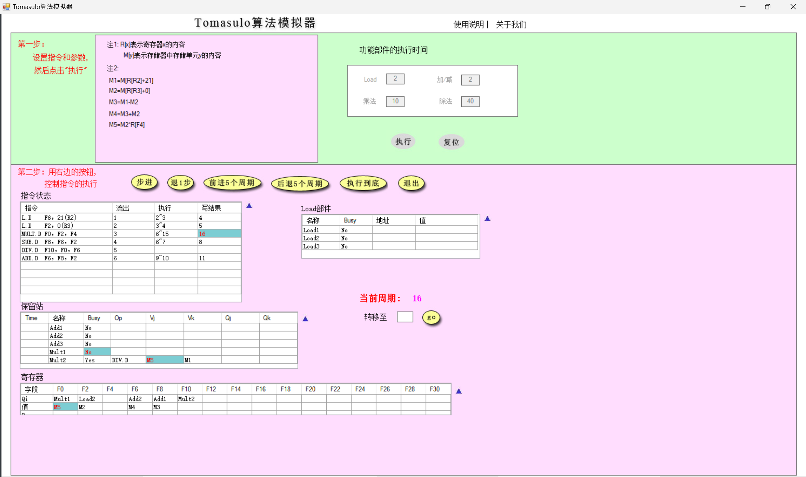

> Computer Architecture Honor Class Lab 6 Report
>
> 郭耸霄 PB20111712

[TOC]

# Tomasulo 算法模拟器

> 使用模拟器进行以下指令流的执行并对模拟器截图、回答问题
> ```assembly
> L.D	F6, 21（R2）
> L.D	F2, 0（R3）
> MUL.D	F0, F2, F4
> SUB.D	F8, F6, F2
> DIV.D	F10, F0, F6
> ADD.D	F6, F8, F2
> ```
>
> 假设浮点功能部件的延迟时间：加减法 2 个周期，乘法 10 个周期，load/store 2 个周期，除法 40 个周期。

## 分别截图（当前周期 2 和当前周期 3 ），请简要说明 Load 部件做了什么改动


指令进入其中的第一个周期时，地址记录为 offset 的值，在第二个周期再与寄存器的值相加，在第三个周期成功读取到目的位置的值。

## 请截图（MUL.D 刚开始执行时系统状态），并说明该周期相比上一周期整个系统发生了哪些改动（指令状态、保留站、寄存器和 Load 部件）


- 指令状态：流出了`ADD.D F6,F8,F2`，执行了`MUL.D F0, F2, F4`和`SUB.D F8, F6, F2`。
- 保留站：`Add1`和`Mult1`开始执行并倒计时，`Add2`放入`ADD.D F6,F8,F2`做准备。
- 寄存器：`F6`被`Add2`使用，变得`busy`。
- Load 部件：没有变化。

## 简要说明是什么相关导致 MUL.D 流出后没有立即执行

与上一条指令的在`F2`寄存器上的 RAW 相关。

## 请分别截图（15 周期和 16 周期的系统状态），并分析系统发生了哪些变化




- 指令状态：`MUL.D F0, F2, F4`写结果。
- 保留站：`Mult1`执行结束，将`Busy`位清除；`Mult2`的第一个操作数准备好。
- 寄存器：`F0`的值由`Mult1`得出，取消`busy`。
- Load 部件：没有变化。

## 回答所有指令刚刚执行完毕时是第多少周期，同时请截图（最后一条指令写 CBD 时认为指令流执行结束）

第 57 周期。


# 多 cache 一致性算法 - 监听法

## 利用模拟器进行下述操作，并填写下表

|   所进行的访问   | 是否发生了替换？ | 是否发生了写回？ | 监听协议进行的操作与块状态改变 |
| :--------------: | :--------------: | :--------------: | :----------------------------: |
| CPU A 读第 5 块  |                  |                  |                                |
| CPU B 读第 5 块  |                  |                  |                                |
| CPU C 读第 5 块  |                  |                  |                                |
| CPU B 写第 5 块  |                  |                  |                                |
| CPU D 读第 5 块  |                  |                  |                                |
| CPU B 写第 21 块 |                  |                  |                                |
| CPU A 写第 23 块 |                  |                  |                                |
| CPU C 写第 23 块 |                  |                  |                                |
| CPU B 读第 29 块 |                  |                  |                                |
| CPU B 写第 5 块  |                  |                  |                                |

## 请截图，展示执行完以上操作后整个cache系统的状态

# 多 cache 一致性算法 - 目录法

## 利用模拟器进行下述操作，并填写下表

|   所进行的访问    | 监听协议进行的操作与块状态改变 |
| :---------------: | :----------------------------: |
|  CPU A 读第 6 块  |                                |
|  CPU B 读第 6 块  |                                |
|  CPU D 读第 6 块  |                                |
|  CPU B 写第 6 块  |                                |
|  CPU C 读第 6 块  |                                |
| CPU D 写第 20 块  |                                |
| CPU A 写第 20 块  |                                |
| CPU  D 写第 6 块  |                                |
| CPU  A 读第 12 块 |                                |

## 请截图，展示执行完以上操作后整个cache系统的状态